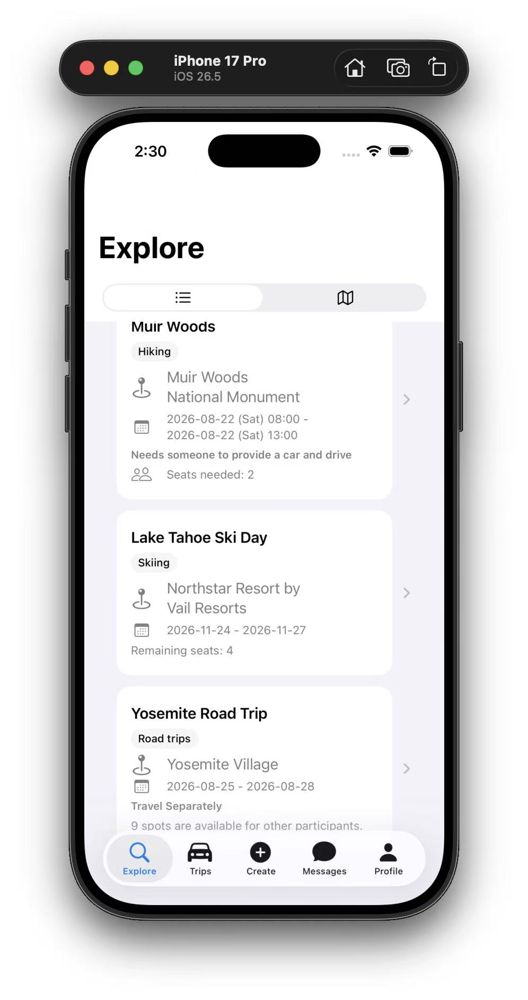
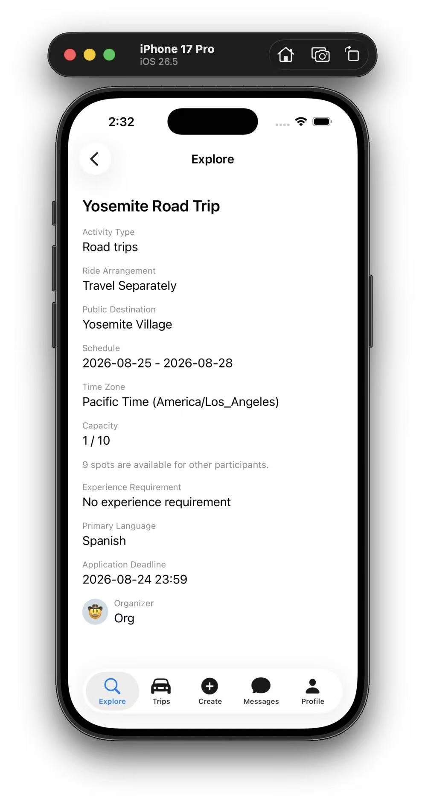
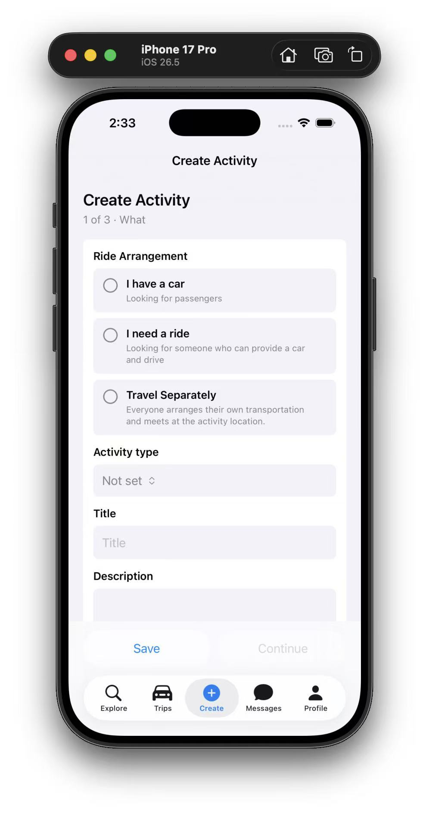
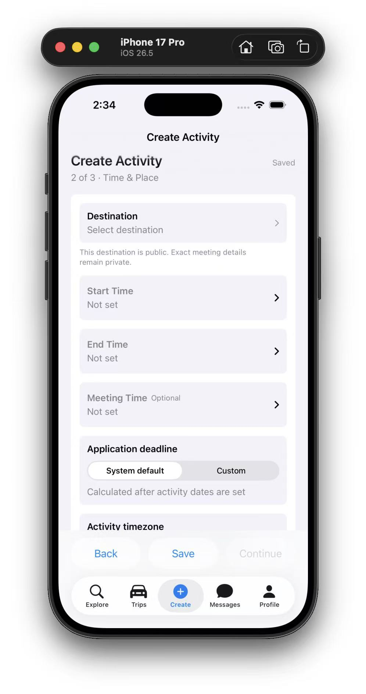
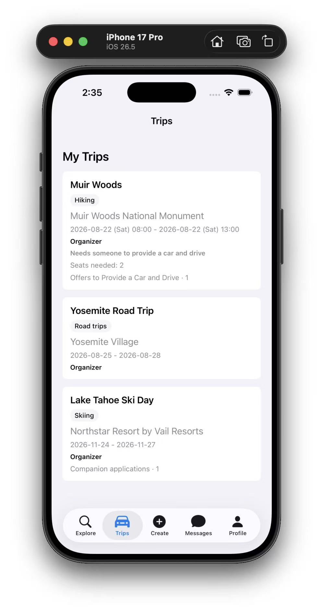
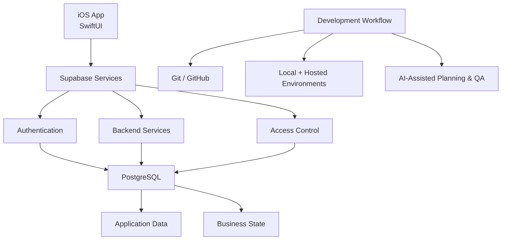

# Yonder

**A private iOS product MVP for outdoor activity planning, ride coordination, and community-based trip organization.**

> This repository is a public case study only.
> The production source code, database implementation, and proprietary business logic remain private because Yonder is under active development.

---

## Overview

Yonder is an iOS product I am designing and developing to make it easier for people to **discover, organize, and coordinate outdoor activities together**.

The product started from a simple problem:

People may know where they want to go, but actually organizing the trip often requires multiple disconnected tools for finding participants, coordinating transportation, managing activity details, and communicating updates.

Yonder explores how those workflows can be brought into one structured mobile experience.

---

## My Role

I am responsible for the product end-to-end, including:

* Product requirements and workflow design
* iOS application development
* Database and access-control design
* Business-rule modeling
* UX and bilingual localization
* QA planning and edge-case validation
* AI-assisted development workflows
* Git-based development and release management

This project has given me experience working across **product, business systems, software development, data modeling, and operational workflows** rather than treating them as separate disciplines.

---

## Technology

**Mobile**

* Swift
* SwiftUI
* Xcode

**Backend & Data**

* Supabase
* PostgreSQL
* SQL
* Authentication and role-based access patterns

**Development**

* Git / GitHub
* Local and hosted development environments
* Structured QA and manual validation

**AI-Assisted Workflow**

* Requirements refinement
* Implementation planning
* Edge-case discovery
* Code review assistance
* QA checklist generation
* Technical documentation

---

## Product Areas

Yonder currently explores several connected product workflows:

### Activity Planning

Users can create and manage structured outdoor activities with dates, locations, participation details, and activity-specific settings.

### Ride Coordination

Transportation can be incorporated into the activity workflow so participants can better coordinate how they will reach the destination.

### Participant Workflows

The product includes structured application and organizer-review flows rather than relying entirely on unstructured group messages.

### Organizer Tools

Organizers can manage their activities, review participation requests, track activity status, and access relevant trip information.

### Privacy & Access Control

Different users receive different levels of access depending on their relationship to an activity.

### Bilingual UX

The application supports English and Simplified Chinese workflows as part of the product architecture rather than as an afterthought.

---

## Product & Systems Challenges

Building Yonder has required solving problems beyond implementing individual screens.

### 1. Turning Product Rules Into System Rules

Many product decisions affect multiple layers of the application.

For example, participation state, visibility, capacity, transportation arrangements, and user roles must remain consistent across the UI, database, and backend logic.

This required translating product requirements into explicit system rules instead of relying only on client-side behavior.

### 2. Data Integrity & Backend Authority

For important workflows, the backend acts as the authoritative source for business rules and derived state.

The goal is to prevent the user interface from becoming the only place where critical logic exists.

### 3. Privacy by Context

Information visibility changes depending on whether someone is:

* browsing publicly,
* applying to an activity,
* an accepted participant, or
* the organizer.

This required thinking carefully about what information each context actually needs.

### 4. Edge Cases

Real-world activity planning introduces many edge cases:

* time zones
* date-only vs. timed activities
* participant capacity
* cancellations
* application state changes
* organizer permissions
* transportation availability
* localization

Designing these flows has been one of the most valuable parts of the project.

---

## How I Use AI

AI is integrated into my development workflow as a **productivity and reasoning tool**, not as a substitute for validation.

I use AI to help with:

* breaking large product requirements into smaller implementation tasks
* reviewing edge cases before implementation
* drafting database and application logic
* identifying potential regression risks
* generating QA scenarios
* reviewing implementation decisions
* improving technical documentation

Outputs are reviewed against the product requirements, database contracts, and actual application behavior before they are accepted.

This human-in-the-loop workflow has helped me move faster while maintaining control over product and technical decisions.

---

## What This Project Demonstrates

Yonder is primarily a product project, but it also demonstrates skills relevant to business systems, data, operations, and technical analyst roles:

* Translating business requirements into system behavior
* Designing structured operational workflows
* Data modeling and data quality thinking
* Role-based information access
* Cross-layer problem solving
* Requirements management
* QA and acceptance criteria
* Product prioritization
* AI-assisted workflow design
* Technical communication

---

## Current MVP Screens

> Current MVP screens from active development. The UI and visual design are still evolving as Yonder moves toward a more polished release.

<table>
  <tr>
    <td width="50%" align="center">
      
       
      <strong>Explore</strong> 
      Discover public activities across different activity types and transportation arrangements.
    </td>
    <td width="50%" align="center">
      
       
      <strong>Activity Detail</strong> 
      Structured activity information including destination, schedule, capacity, organizer, and participation details.
    </td>
  </tr>
  <tr>
    <td width="50%" align="center">
      
       
      <strong>Ride Arrangement</strong> 
      Transportation is modeled as part of the activity workflow instead of being handled through separate coordination.
    </td>
    <td width="50%" align="center">
      
       
      <strong>Time & Place</strong> 
      Activity scheduling includes destination, timing, application deadlines, and timezone-aware behavior.
    </td>
  </tr>
</table>

  

  <strong>Trips</strong> 
  A consolidated view for activities the user organizes or participates in.

---

## Architecture

## Architecture

Yonder uses a lightweight mobile-first architecture designed around a SwiftUI client, Supabase services, and PostgreSQL-backed application data.

### Public Architecture Scope

This diagram intentionally shows only the high-level system structure.

Detailed database schemas, backend functions, security policies, migrations, internal APIs, and proprietary business rules are not published.

---

## Current Status

**Active MVP development**

The application is being developed iteratively with individual product features designed, implemented, validated, and integrated in small releases.

The full Yonder repository remains private.

---

## Repository Scope

This public repository may contain:

* Product overview
* Screenshots
* Architecture diagrams
* Sanitized workflow examples
* Selected non-proprietary technical decisions
* Product and systems case studies

It does **not** contain:

* Production source code
* Database schemas
* Database migrations
* Authentication configuration
* Security policies
* API credentials
* Proprietary backend logic
* Complete product specifications

---

## Intellectual Property

Copyright © 2026 Zhi (Vincent) Dong. All rights reserved.

This repository is provided for **portfolio and professional review purposes only**.

No permission is granted to copy, reproduce, distribute, commercialize, or reuse Yonder's product design, documentation, workflows, architecture, or other proprietary materials without written permission.
